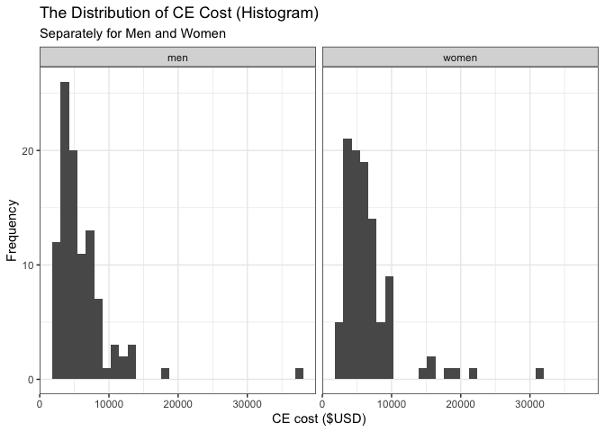
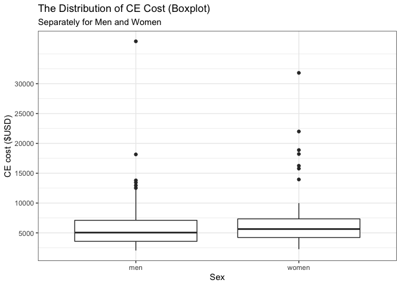
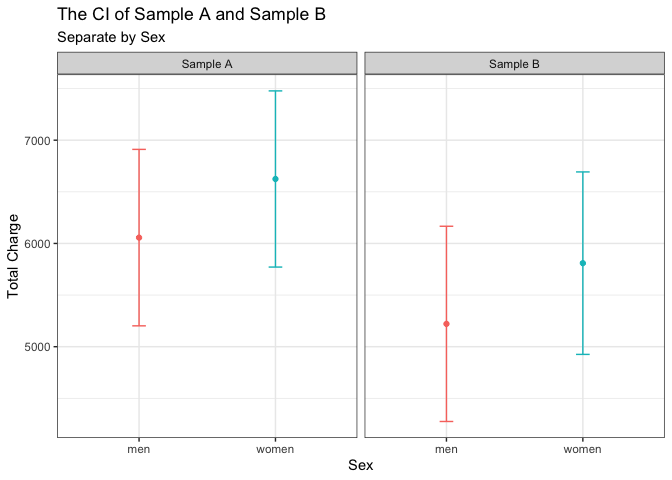

P8130\_hw2\_wq2160
================
Wenshan Qu (wq2160)

## Problem 1

Draw a random sample without replacement of 200 observations (100 men
and 100 women) from the entire CE data set named ce8130entire.csv. Call
this first sample “A” and save the sample. In “sex” variable, **men**
are identified by **“1”**, and **women** by **“2”**. Note: To obtain the
sample data set of approximately 200 observations, you can use the
following code. Replace the “set.seed” number with an integer of your
choice (3 points).

``` r
population = read.csv("./ce8130entire.csv")

set.seed(33)
A = 
  population %>% 
  group_by(sex) %>% 
  sample_n(100)

A
```

    ## # A tibble: 200 × 7
    ## # Groups:   sex [2]
    ##    provnum   sex  race smoker totchg   age  year
    ##      <int> <int> <int>  <int>  <int> <int> <int>
    ##  1      28     1     0      0  13434    78  1995
    ##  2      21     1     0      0   7701    60  1995
    ##  3       7     1     0      0   2225    67  1991
    ##  4      20     1     0      0   8369    68  1994
    ##  5      47     1     0      0   3095    77  1992
    ##  6       7     1     0      0   4134    68  1992
    ##  7      14     1     0      0   3226    63  1992
    ##  8      27     1     0      0   4592    71  1992
    ##  9      48     1     0      0   4988    60  1993
    ## 10      14     1     0      0   5180    68  1994
    ## # … with 190 more rows

## Problem 2

Now use the same seed as before but this time draw a random sample
without replacement of 60 observations (30 men and 30 women) and call it
sample “B” (Note that Sample “B” is more than 3 times smaller than
sample “A”). Save it as a separate sample. Replace the seed number with
the same seed number as you used above (3 points).

``` r
set.seed(33)
B = 
  population %>% 
  group_by(sex) %>% 
  sample_n(30)

B
```

    ## # A tibble: 60 × 7
    ## # Groups:   sex [2]
    ##    provnum   sex  race smoker totchg   age  year
    ##      <int> <int> <int>  <int>  <int> <int> <int>
    ##  1      28     1     0      0  13434    78  1995
    ##  2      21     1     0      0   7701    60  1995
    ##  3       7     1     0      0   2225    67  1991
    ##  4      20     1     0      0   8369    68  1994
    ##  5      47     1     0      0   3095    77  1992
    ##  6       7     1     0      0   4134    68  1992
    ##  7      14     1     0      0   3226    63  1992
    ##  8      27     1     0      0   4592    71  1992
    ##  9      48     1     0      0   4988    60  1993
    ## 10      14     1     0      0   5180    68  1994
    ## # … with 50 more rows

## Problem 3

Using sample “A”, display the distribution of CE cost in $USD (variable
name: “totchg”) separately for men and women using side-by-side boxplots
and histograms. Label your figures appropriately.

**Histogram**

``` r
hist_plot = 
A %>% 
  mutate(sex = recode(sex, "1" = "men", "2" = "women")) %>% 
  ggplot(aes(x = totchg)) +
  geom_histogram() +
  facet_grid(. ~ sex) +
  labs(
    title = "The Distribution of CE Cost (Histogram)",
    subtitle = "Separately for Men and Women",
    x = "CE cost ($USD)",
    y = "Frequency"
  ) +
  theme_bw()

hist_plot
```

    ## `stat_bin()` using `bins = 30`. Pick better value with `binwidth`.

<!-- -->

**Boxplot**

``` r
boxp_plot = 
A %>% 
  mutate(sex = recode(sex, "1" = "men", "2" = "women")) %>% 
  ggplot(aes(x = sex, y = totchg)) +
  geom_boxplot() +
  labs(
    title = "The Distribution of CE Cost (Boxplot)",
    subtitle = "Separately for Men and Women",
    x = "Sex",
    y = "CE cost ($USD)"
  ) +
  scale_y_continuous(
    breaks = c(5000, 10000, 15000, 20000, 25000, 30000),
    labels = c("5000", "10000", "15000", "20000", "25000", "30000")
  ) +
  theme_bw()

boxp_plot
```

<!-- -->

## Problem 4

Calculate the mean CE cost and 95% confidence interval separately for
men and women in sample “A” as well as sample “B”. Assume we don’t know
the population variance. Plot the sample “A” and sample “B” confidence
intervals next to each other (by sex). How do they differ, which
confidence intervals are wider? Explain why. \#\#Note: For the purposes
of confidence interval estimation and hypothesis testing, let’s assume
that all the assumptions, including the assumption of normal
distribution, are met.

#### 4.1 Plot sample A and B CI

``` r
A_s = 
  A %>% 
  mutate(sample = c("Sample A"))

B_s = 
  B %>% 
  mutate(sample = c("Sample B"))

AB_df = rbind(A_s, B_s)

p_dodge = position_dodge(0.1)

AB_plot = 
AB_df %>% 
  mutate(sex = recode(sex, "1" = "men", "2" = "women")) %>% 
  summarySE(measurevar = "totchg", groupvars = c("sex", "sample")) %>% 
  ggplot(aes(x = sex, y = totchg, color = sex)) +
  geom_point() +
  geom_errorbar(aes(ymin = totchg - ci, ymax = totchg + ci), width = .1, position = p_dodge) +
  facet_grid(. ~ sample) +
  labs(
    title = "The CI of Sample A and Sample B",
    subtitle = "Separate by Sex",
    x = "Sex",
    y = "Total Charge"
  ) +
  theme_bw() +
  theme(legend.position = "none")

AB_plot
```

<!-- -->

#### 4.2 Manually calculation for Sample A

**mean CE cost and 95% confidence interval for MEN**

``` r
A_men = 
A %>% 
  filter(sex == "1")

## Mean CE cost for MEN
mean1 = 
A_men %>% 
  summarize(mean_cost_men = mean(totchg)) 

mean1
```

    ##   mean_cost_men
    ## 1       6056.47

``` r
## 95% CI for MEN
x1 = mean(pull(A_men, totchg))
s1 = sd(pull(A_men, totchg))
n1 = 100
t1 = qt(0.975, df = 100 - 1)

upper1 = x1 + t1 * s1 / sqrt(n1)
lower1 = x1 - t1 * s1 / sqrt(n1)

upper1
```

    ## [1] 6910.899

``` r
lower1
```

    ## [1] 5202.041

**mean CE cost and 95% confidence interval for WOMEN**

``` r
A_women = 
A %>% 
  filter(sex == "2")

## Mean CE cost for WOMEN
mean2 = 
A_women %>% 
  summarize(mean_cost_women = mean(totchg)) 

mean2
```

    ##   mean_cost_women
    ## 1         6624.28

``` r
## 95% CI for WOMEN
x2 = mean(pull(A_women, totchg))
s2 = sd(pull(A_women, totchg))
n2 = 100
t2 = qt(0.975, df = 100 - 1)

upper2 = x2 + t2 * s2 / sqrt(n2)
lower2 = x2 - t2 * s2 / sqrt(n2)

upper2
```

    ## [1] 7477.367

``` r
lower2
```

    ## [1] 5771.193

#### 4.3 Manually calculation for Sample B

**mean CE cost and 95% confidence interval for MEN**

``` r
B_men = 
B %>% 
  filter(sex == "1")

## Mean CE cost for MEN
mean3 = 
B_men %>% 
  summarize(mean_cost_men = mean(totchg)) 

mean3
```

    ##   mean_cost_men
    ## 1      5221.133

``` r
## 95% CI for MEN
x3 = mean(pull(B_men, totchg))
s3 = sd(pull(B_men, totchg))
n3 = 30
t3 = qt(0.975, df = 30 - 1)

upper3 = x3 + t3 * s3 / sqrt(n3)
lower3 = x3 - t3 * s3 / sqrt(n3)

upper3
```

    ## [1] 6166.488

``` r
lower3
```

    ## [1] 4275.779

**mean CE cost and 95% confidence interval for WOMEN**

``` r
B_women = 
B %>% 
  filter(sex == "2")

## Mean CE cost for WOMEN
mean4 = 
B_women %>% 
  summarize(mean_cost_women = mean(totchg)) 

mean2
```

    ##   mean_cost_women
    ## 1         6624.28

``` r
## 95% CI for WOMEN
x4 = mean(pull(B_women, totchg))
s4 = sd(pull(B_women, totchg))
n4 = 30
t4 = qt(0.975, df = 30 - 1)

upper4 = x4 + t4 * s4 / sqrt(n4)
lower4 = x4 - t4 * s4 / sqrt(n4)

upper4
```

    ## [1] 6692.608

``` r
lower4
```

    ## [1] 4925.459

Q1: How do they differ?

A1: There is a obvious trend that the mean CE cost of women is higher
than men in both samples, and this cost difference is about 570 USD.
(Note: According to Sample A and B.)

Q2: Which CI are wider?

A2: I think the CI width of two sample groups are nearly the same, and
the CI width of men and women in each sample group are also nearly the
same. According to calculation, in Sample A, the CI width of Men is
1708.86, of Women is 2273.98; in Sample B the CI width of Men is
1890.71, of Women is 1767.15. Consequently, there is no significant
difference exists.

Q3: Explain why?

A3: Sample A and B come from the same source population, then the total
“trend” in these two samples should be nearly the same, which means they
are shows that 1) the CE cost of women is higher than men; and 2) there
is no significantly CI difference between women and men. However, Sample
A have a size of 200, Sample B only have 60 sample size, so the latter
one may more far away from the truth.

``` r
## We can simply calculate the CI interval for each group
upper1-lower1 ## Sample A Men
```

    ## [1] 1708.858

``` r
upper2-lower2 ## Sample A Women
```

    ## [1] 1706.173

``` r
upper3-lower3 ## Sample B Men
```

    ## [1] 1890.709

``` r
upper4-lower4 ## Sample B Women
```

    ## [1] 1767.149

## Problem 5

Conduct test of equality of variance of CE cost among men vs women in
sample A and interpret your results.

**Method 1**

``` r
var.test(totchg ~ sex, data = A)
```

    ## 
    ##  F test to compare two variances
    ## 
    ## data:  totchg by sex
    ## F = 1.0031, num df = 99, denom df = 99, p-value = 0.9875
    ## alternative hypothesis: true ratio of variances is not equal to 1
    ## 95 percent confidence interval:
    ##  0.6749611 1.4909153
    ## sample estimates:
    ## ratio of variances 
    ##            1.00315

**Method 2**

``` r
## Test statistic for F test
F_test = s1^2 /s2^2
## F critical value
F_crit = qf(0.975, 99, 99)
## Decision
ifelse(F_test > F_crit, "reject", "fail to reject")
```

    ## [1] "fail to reject"

Conclusion: In Method 1, the p-value is 0.9875 &gt; 0.05, we can not
reject null hypothesis; In Method 2, the test statistic is 1.00315 &lt;
F critical value = 1.486, which means it falls into the fail to reject
region. Combinding results above, we can say that **The variance of CE
cost among men and women in sample A statistically have no significant
difference. In other words, in sample A, the variances of CE cost among
men and women are equal.**

## Problem 6

Using sample “A”, calculate the difference between the mean CE costs for
men and women (cost in men -cost in women). Calculate a 95% CI for this
difference. Assume we don’t know the population variance. Your decision
of equal vs unequal variance should be based on your answer in Problem
5.

``` r
## Difference betweeen the mean CE costs for men and women
diff_A = x1 - x2
diff_A
```

    ## [1] -567.81

``` r
# calculate pooled sd
sd_pooled = sqrt((s1^2 * 99 + s2^2 * 99) / 198)
## 95% CI
diffci_lower = diff_A - qt(0.975, 198) * sd_pooled * sqrt((1/99) + (1/99))
diffci_upper = diff_A + qt(0.975, 198) * sd_pooled * sqrt((1/99) + (1/99))
diffci_lower
```

    ## [1] -1773.828

``` r
diffci_upper
```

    ## [1] 638.2081

Conclusion: difference between the mean CE costs for men and women is
-567.81, and the 95% CI for this difference is (-1773.83, 638.21).

## Problem 7

Now use sample “A” to test the hypothesis whether men and women have a
different CE cost. State the null and alternative hypotheses and
interpret your results.

Note: in Problem 5, my data shows that the variances are equal.
Therefore, we conduct a two-sample t-test for equal variances by pooling
the standard deviations.

The **null hypothesis** is: The mean CE costs for men and women are
equal. The **alternative hypothesis** is: The mean CE costs for men and
women are different (not equal).

``` r
# calculate test statistic
t_stat = (x1 - x2) / (sd_pooled * sqrt((1/99) + (1/99)))
# calculate critical value
t_crit = qt(0.975, df = 99 + 99 -2)
# decision
ifelse(abs(t_stat) > t_crit, "reject", "fail to reject")
```

    ## [1] "fail to reject"

Also, we can use this method:

``` r
t.test(totchg ~ sex, data = A, var.equl = TRUE)
```

    ## 
    ##  Welch Two Sample t-test
    ## 
    ## data:  totchg by sex
    ## t = -0.93313, df = 198, p-value = 0.3519
    ## alternative hypothesis: true difference in means between group 1 and group 2 is not equal to 0
    ## 95 percent confidence interval:
    ##  -1767.7829   632.1629
    ## sample estimates:
    ## mean in group 1 mean in group 2 
    ##         6056.47         6624.28

Intepretation: Combining two results, we fail to reject the null
hypotheses, and we can conclude that there is no significant difference
of CE cost between men and women.

## Problem 8

Use your results from Sample A: graphs, estimates, confidence intervals,
and/or test results, to write a one paragraph summary of your findings
regarding the average costs of CE for men and women. Write as if for an
audience of health services researchers. Be quantitative and use
health-services language, rather than statistical jargon in your
write-up.

**Answer**

We randomly sampled 200 individuals from HSCRC database with 100 men and
100 women, for the purpose of finding the difference of mean CE costs
between men and women in Maryland for the period 1990 through 1995.
After plotting our sample with histogram and boxplot, we can see that
there is a slight difference between the mean CE costs of men and women,
specificlly, the average cost for women is about 570 USD higher than men
in this sample. Using this sample, we try to assume the true value for
underlying population. After calculation, we are 95% confident that
there is no significant difference of average CE cost between men and
women.

## Problem 9

Now for the truth, which we have the luxury of knowing in this problem
set. Compute the actual mean CE cost for men ( µ M ) and for women ( µ W
) for the whole population (CE8130entire.csv). Also calculate the
difference ( µ M − µ W ). Do your 95% CIs include the true means?

``` r
pop_men = 
population %>% 
  filter(sex == "1")

## Actual mean CE cost for men
pop_men %>% 
  summarize(pop_men_mean = mean(totchg))
```

    ##   pop_men_mean
    ## 1     6890.872

``` r
pop_women = 
  population %>% 
  filter(sex == "2") 

## Actual mean CE cost for women
pop_women %>% 
  summarize(pop_women_mean = mean(totchg))
```

    ##   pop_women_mean
    ## 1       7014.377

``` r
xa = mean(pull(pop_men, totchg))
xb = mean(pull(pop_women, totchg))

## Mean difference
xa - xb
```

    ## [1] -123.5047

My 95% CI for women is (5771.193, 7477.367), and it includes the true
value 7014,377; My 95% CI for men is (5202.041, 6910.899), and it
includes the true value 6890.872; My 95% CI for mean difference is
(-1773.828, 638.2081), and it includes the true difference -123.5047.

## Problem 10

If each student in a class of 140 calculates a 95% confidence interval
for ( µ M − µ W ), how many of these intervals do you expect to contain
the true population mean difference? Calculate the probability that all
140 will contain the true population mean difference.

**Answer**

For the defination of CI, it’s “Over the collection of all 95% CIs that
could be constructed from repeated samples of size n, 95% of them will
contain the true population mean”. So for each student, they have the
probability of 0.95 to contain true mean difference. Then the
probability of all 140 contain the true population mean difference:

``` r
## Probability
0.95^140
```

    ## [1] 0.00076086

It is 0.00076, which is surprisingly low.
